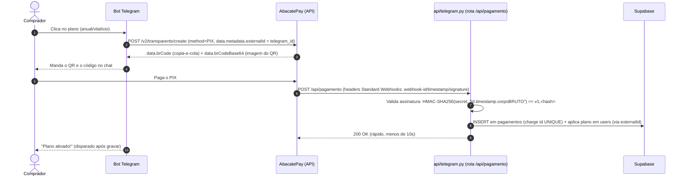

# Plano de Monetização — LekoAIFinance (AbacatePay)

> Revisão 2 — corrige o plano original após auditoria do código real.
> Revisão 3 (31/08/2026) — troca o gateway de Kiwify para **AbacatePay**. O pagamento ainda não
> estava em código, então a troca reescreve plano, não sistema. As seções de segurança/auditoria
> (6.1–6.4, 6.6) não dependem do gateway e seguem valendo.
> Decisões travadas em 22/08/2026.

---

## 0. Decisões já tomadas (não reabrir)

| Item | Decisão |
| :--- | :--- |
| Gateway | **AbacatePay** (PIX-first; cobrança criada via API de dentro do bot, com SDK Python oficial) |
| Grátis | 20 lançamentos/mês + relatório de no máximo 7 dias |
| LekoAI Plus mensal | R$ 14,90/mês — **cartão** (`subscription`, renova sozinho) |
| LekoAI Plus anual | R$ 119,00/ano — **PIX avulso** (bot avisa perto de vencer) |
| LekoAI Vitalício | R$ 200,00 pagamento único — **PIX avulso** |
| Plus vencido | **Bloqueia** + o bot manda mensagem pedindo pra renovar (decidido 2026-09-01; **não** rebaixa pro free). Motivo `plano_expirado` |
| Recorrência | PIX **não** faz débito automático; `subscription` do AbacatePay só aceita CARD. Por isso mensal = cartão, anual/vitalício = PIX |
| Paywall | Mensagem com botões dos planos; o bot **cria a cobrança na hora** (QR PIX no chat, ou link de checkout do cartão) |
| Banco de teste | Mesmo Supabase da produção; isolamento pelo `telegram_id` do bot de dev |

---

## 1. Correções em relação ao plano original

Quatro pontos do plano v1 **não funcionariam** e foram reescritos:

1. **`api/payment_webhook.py` daria 404.** A Vercel aqui roda com entrypoint único
   (`pyproject.toml` → `[tool.vercel] entrypoint = "api.telegram:handler"`). O histórico já mostra
   essa briga nos commits `4f43741` → `ab505d9`. A lógica vai para `tools/payment_service.py` e o
   despacho para `api/telegram.py`, seguindo o padrão que já funciona em `tools/chamados_service.py`.

2. **A ponte gateway ↔ Telegram foi simplificada pelo AbacatePay.** A Kiwify era checkout hospedado e
   só entregava e-mail/CPF, exigindo token de ativação + deep link. Como o AbacatePay deixa **criar a
   cobrança via API já com `metadata.externalId = telegram_id`**, o webhook volta sabendo de quem é —
   a ativação vira direta, sem token, no caminho PIX (ver seção 4). Fica só uma ressalva a confirmar
   no checkout de assinatura (cartão), tratada na seção 4.

3. **O schema v1 assumia degustação por tempo** (`NOW() + 7 days`), mas a degustação escolhida é por
   **quantidade**. Com o SQL antigo todo usuário seria bloqueado no 8º dia sem ter usado nada.

4. **O token de ativação não pode morar em `users`.** O webhook chega *antes* de o comprador existir
   na tabela — ele pode nunca ter falado com o bot. Precisa de tabela própria (`pagamentos`).

---

## 2. Princípio de arquitetura: uma porta só

Hoje existem **dois caminhos** até o relatório, e só um passa por `process_message`:

- `process_message` → botões de formato → *(usuário clica)* → `gerar_relatorio_por_formato`
- o clique é tratado **direto** em `api/telegram.py` (`do_POST`, bloco `callback_query`) e em
  `tools/telegram_bot.py` (`handle_callback_query`) — **sem passar por `process_message`**

Se o gate ficar só no `process_message`, um usuário free clica num botão antigo do histórico e
recebe o relatório de 6 meses. Por isso:

> Toda decisão de acesso vive em **`tools/subscription.py::check_access()`**. Nenhum outro arquivo
> decide se o usuário pode. Os três pontos de chamada (registrar, relatório-texto,
> `gerar_relatorio_por_formato`) chamam a mesma função.

Colocar o gate **dentro** de `gerar_relatorio_por_formato` cobre os dois caminhos de callback de
graça, porque tanto o webhook quanto o bot local chamam essa mesma função.

---

## 3. Ambiente de teste sem regras de pagamento

Três camadas independentes, da mais barata para a mais isolada.

### 3.1 Bypass de admin (rede de segurança permanente)

```
ADMIN_TELEGRAM_IDS=123456789
```

Primeira linha do `check_access()`. Vale **inclusive em produção** — você testa no bot real, pelo
celular, sem subir nada.

### 3.2 Kill switch global

```
PAYWALL_ENABLED=false
```

Desliga o paywall inteiro. No `.env` local fica `false`. Na Vercel, escopar a variável **só para
Preview**, mantendo Production em `true`.

### 3.3 Bot de teste separado (obrigatório para rodar local)

⚠️ **O mesmo token não serve para os dois.** Com um webhook registrado, o `getUpdates` do polling
falha com `409 Conflict`. Rodar `tools/telegram_bot.py` com o token de produção exigiria apagar o
webhook — derrubando a produção.

Peça um segundo bot ao @BotFather e use o token dele no `.env` local:

| Ambiente | Bot | Como roda | Paywall |
| :--- | :--- | :--- | :--- |
| Local | `@LekoAIFinanceDevBot` | `python -m tools.telegram_bot` | desligado |
| Produção | bot real | webhook na Vercel | ligado |

Como o bot de dev tem outro `telegram_id`, ele vira **outra linha em `users`** — os dados de teste
ficam naturalmente separados dos reais, sem precisar de um segundo banco.

### 3.4 Simular estados de plano

Comando `/dev` restrito a `ADMIN_TELEGRAM_IDS` (checagem de admin na primeira linha):

```
/dev plano free           -> vira free
/dev plano plus_expirado  -> plus com expires_at = ontem
/dev plano lifetime       -> vitalício
/dev lancamentos 19       -> simula 19 de 20 usados
/dev status               -> mostra o veredito do check_access
```

### 3.5 Simular a compra no AbacatePay

Duas formas, da mais realista para a mais controlada:

1. **Sandbox do próprio AbacatePay** (`devMode`): a plataforma tem ambiente de teste que dispara os
   webhooks de verdade sem cobrar dinheiro real. Melhor para validar o fluxo ponta a ponta.
2. Script `scripts/fake_abacatepay.py` que monta o payload v2 **e calcula a assinatura HMAC-SHA256 de
   verdade** com o `ABACATEPAY_WEBHOOK_SECRET` de teste, no header `X-Webhook-Signature`, além do
   secret na query string. Passa pelo mesmo caminho de validação do código real.

> Deliberadamente **não** existe um "modo sem validação de assinatura". Esse tipo de atalho vaza para
> produção e vira brecha.

---

## 4. Fluxo de ativação (AbacatePay → Telegram)

Diferente da Kiwify: como o bot **cria a cobrança via API**, ele já conhece o `telegram_id` na hora e
o anexa como `metadata.externalId`. O webhook volta com esse id, então a ativação é **direta, sem
token de ativação** — o furo "não sei de quem é esse pagamento" desaparece no caminho PIX.

### 4.1 Caminho PIX (Plus anual e Vitalício)



**Idempotência:** o id da cobrança do AbacatePay entra em `pagamentos.order_id` (UNIQUE) — reenvio do
webhook não duplica.

### 4.2 Caminho cartão (Plus mensal, `subscription`)

Assinatura no AbacatePay só aceita **cartão** e usa um checkout **hospedado**: o bot cria a assinatura
e manda um botão com a URL (`https://app.abacatepay.com/pay/...`). Renova sozinho; `subscription.renewed`
estende a validade, `subscription.cancelled` revoga.

⚠️ **Único ponto a confirmar no painel/docs:** se o checkout de `subscription` aceita `metadata.externalId`.
- **Se aceitar** → mesma ativação direta do PIX, pelo `externalId`.
- **Se não aceitar** → cai no plano B clássico: `returnUrl` do checkout aponta para
  `https://t.me/SeuBot?start=<token>`, e mantemos o token de ativação **só neste caminho**. Por isso o
  `/start <token>` continua previsto no código (Componente 4), como rede de segurança.

**Por que não casar por e-mail:** se o bot apenas perguntasse o e-mail, qualquer pessoa que
descobrisse o e-mail de um comprador ativaria o plano no lugar dele.

Ponto de atenção: o `/start` **hoje descarta o payload** — `tools/message_handler.py` faz
`text.strip().lower().startswith("/start")` e ignora o resto. Precisa passar a ler `/start <token>`
(usado só no fallback de cartão).

---

## 5. Alterações no código

### Componente 1 — Schema Supabase

```sql
-- 1) Colunas de plano em users
ALTER TABLE users
ADD COLUMN IF NOT EXISTS plan_type VARCHAR(20) NOT NULL DEFAULT 'free',
    -- 'free' | 'plus_monthly' | 'plus_annual' | 'lifetime'
ADD COLUMN IF NOT EXISTS subscription_expires_at TIMESTAMPTZ,
    -- NULL em 'free' e em 'lifetime' (vitalício não expira)
ADD COLUMN IF NOT EXISTS customer_email VARCHAR(255);

-- 2) Pagamentos: chega ANTES de o usuário existir, então é tabela separada
CREATE TABLE IF NOT EXISTS pagamentos (
  id               BIGSERIAL PRIMARY KEY,
  order_id         TEXT NOT NULL UNIQUE,   -- id da cobrança do AbacatePay; idempotência: reenvio não duplica
  customer_email   TEXT,                   -- pode vir null/mascarado no webhook v2
  external_id      TEXT,                   -- telegram_id anexado como metadata.externalId (ligação direta no PIX)
  plan_type        TEXT NOT NULL,
  status           TEXT NOT NULL,          -- 'pago' | 'estornado'
  activation_token TEXT UNIQUE,            -- só usado no fallback de cartão (ver 4.2)
  user_id          BIGINT REFERENCES users(id),  -- NULL até casar via externalId ou /start com token
  event_raw        JSONB,
  created_at       TIMESTAMPTZ DEFAULT NOW(),
  activated_at     TIMESTAMPTZ
);
CREATE INDEX IF NOT EXISTS idx_pagamentos_token ON pagamentos(activation_token);

-- 3) Contagem de lançamentos do mês (usada pelo gate do plano free)
CREATE INDEX IF NOT EXISTS idx_gastos_user_created ON gastos(user_id, created_at);

-- 4) Defesa em profundidade (ver 6.2): hoje só o RLS trava, e os GRANTs de
--    fábrica do Supabase deixam anon com UPDATE em tudo. Revogar explicitamente
--    para que uma policy criada sem cuidado no futuro não abra o que importa.
ALTER TABLE public.pagamentos ENABLE ROW LEVEL SECURITY;
REVOKE ALL ON TABLE public.pagamentos FROM anon, authenticated;
REVOKE UPDATE (plan_type, subscription_expires_at, customer_email)
  ON TABLE public.users FROM anon, authenticated;
-- Nenhuma policy em pagamentos: só a chave secreta (servidor) acessa.
```

`order_id UNIQUE` resolve idempotência de graça: reenvio do mesmo evento dá conflito e é ignorado, em
vez de somar 12 meses duas vezes num plano anual.

### Componente 2 — `tools/subscription.py` [NOVO]

Módulo puro, sem HTTP, testável isolado.

```python
LIMITE_LANCAMENTOS_FREE = 20
LIMITE_DIAS_RELATORIO_FREE = 7

def check_access(user_row: dict, acao: str) -> Verdict
```

Ordem de avaliação:

1. `PAYWALL_ENABLED` falso → **LIBERADO**
2. `user_row["telegram_id"]` em `ADMIN_TELEGRAM_IDS` → **LIBERADO**
3. `plan_type == "lifetime"` → **LIBERADO**
4. `subscription_expires_at > now()` → **LIBERADO**
5. Free: `registrar` → liberado se lançamentos do mês < 20; `relatorio` → liberado se período ≤ 7 dias
6. Caso contrário → **BLOQUEADO** com motivo (`cota_estourada` / `periodo_longo` / `plano_expirado`)

O `Verdict` carrega o motivo para o paywall montar a mensagem certa.

### Componente 3 — `tools/db_manager.py` [MODIFICAR]

- `get_or_create_user_row(telegram_id, name) -> dict` — nova, devolve a linha **inteira**
  (`id`, `telegram_id`, `plan_type`, `subscription_expires_at`). Evita segunda query só pro plano.
- `get_or_create_user()` continua existindo como wrapper de uma linha (`row["id"]`), então
  **nenhum chamador atual quebra**.
- `contar_lancamentos_mes(user_id) -> int` — conta `gastos` por `created_at` no mês corrente.
  ⚠️ Usar fuso **America/Sao_Paulo** para a virada do mês (o projeto já tem `tzdata` e já corrigiu
  fuso no commit `b21714c`).
- `aplicar_plano(user_id, plan_type, expires_at)` — usada pela ativação.
- `revogar_plano(user_id)` — usada em estorno/chargeback.

> Optamos por **derivar** a contagem de `gastos` em vez de manter um contador em `users`: não precisa
> resetar no virar do mês e nunca dessincroniza. Efeito colateral aceito: apagar um lançamento
> devolve cota.

### Componente 4 — `tools/message_handler.py` [MODIFICAR]

- Trocar `get_or_create_user` por `get_or_create_user_row`
- `/start` passa a aceitar payload: `/start <token>` → ativa o plano
- Gate no branch `registrar` e no branch `relatorio`
- **Gate dentro de `gerar_relatorio_por_formato`** ← fecha o furo dos botões
- `LIMITE_DIAS_PDF = 7` continua sendo "vira arquivo", **sem se confundir** com
  `LIMITE_DIAS_RELATORIO_FREE = 7`, que é "precisa pagar". Mesmo número, significados diferentes —
  manter os dois nomes separados para não colar as regras.
- Comando `/plano`: mostra plano atual, validade e (se free) `17/20 lançamentos usados`
- Comando `/dev`: só para admins

### Componente 5 — `tools/payment_service.py` [NOVO]

Duas responsabilidades. Diferente da Kiwify (checkout pronto), aqui o bot **cria** a cobrança, então
o módulo tem lado de saída (criar) e lado de entrada (webhook). Pode usar o SDK Python oficial do
AbacatePay ou `requests` direto.

**A) Criar cobrança (saída, chamado pelo paywall):**

```python
def criar_cobranca(plan_type: str, telegram_id: int, nome: str) -> dict
# anual/vitalício -> POST /v2/transparents/create
#                    body: {"method":"PIX","data":{"amount","metadata":{"externalId": telegram_id}}}
#                    resposta: {"success","data":{brCode, brCodeBase64, id, ...},"error"}
# plus_monthly     -> cria subscription (cartão), devolve {url}  (ver ressalva em 4.2)
```

Auth por `Authorization: Bearer <ABACATEPAY_API_KEY>`.

⚠️ **Dois detalhes confirmados em teste de sandbox (2026-08-31), fáceis de errar:**
- A resposta vem **embrulhada** em `{"success", "data", "error"}` — ler `resp["data"]`, não a raiz.
- O id do usuário volta em **`data.metadata.externalId`**. Um `externalId` "solto" (fora de `metadata`)
  **não** é ecoado — mandar sempre dentro de `metadata`.
- O Cloudflare do AbacatePay **bloqueia o User-Agent padrão do `urllib`** (erro `1010`). Mandar um
  `User-Agent` próprio (o SDK usa `Python SDK <versão>`); com `requests`/SDK isso já vem resolvido.

**B) Receber webhook (entrada), espelhando o contrato de `tools/chamados_service.py`:**

- `handle_webhook(headers, raw_body, query) -> (int, dict)`
- **Validação = Standard Webhooks** (confirmado no payload real de 2026-08-31, ver 6.7 — a doc estava
  errada). Três headers: `webhook-id`, `webhook-timestamp`, `webhook-signature` (valor `v1,<base64>`).
  Recalcular `base64(HMAC-SHA256(secret, f"{webhook-id}.{webhook-timestamp}.{corpo_bruto}"))` **antes
  do `json.loads`**, comparar em tempo constante (`hmac.compare_digest`) contra o hash após o `v1,`, e
  **rejeitar `timestamp` fora de uma janela** (ex.: ±5 min) para barrar replay. **Não** há secret na
  query string (a URL registrada não teve query e mesmo assim veio assinada).
- `ABACATEPAY_WEBHOOK_SECRET` = o **signing secret** do webhook no painel (formato `whsec_...`), não um
  valor inventado. Como temos um payload real assinado, dá para testar o validador até bater.
- **Falha fechada** (ver 6.5): sem `ABACATEPAY_WEBHOOK_SECRET` configurado, rejeita tudo. O oposto do
  `auth_ok()` de `chamados_service.py`. Um webhook de pagamento que falha aberto = qualquer pessoa
  manda um aviso de compra falso e ganha vitalício.
- **Envelope real:** `{type, timestamp, apiVersion:2, devMode, data}` — o evento vem em **`type`** (não
  `event`), e a cobrança fica **aninhada por tipo** em `data.<tipo>` (ex.: `data.transparent`,
  presumivelmente `data.subscription`/`data.checkout`). Dá para derivar o sub-campo do prefixo do `type`.
  Eventos tratados (nomes reais confirmados no painel):
  - `transparent.completed` → ativa (PIX pago); `subscription.completed`/`.renewed` → ativa/estende (cartão)
  - `transparent.refunded` / `transparent.disputed` / `transparent.lost` → **revoga**
  - `subscription.cancelled` → revoga no fim do ciclo; `subscription.payment_failed` → avisar/marcar
  - `checkout.*` só se usarmos checkout hospedado (hoje o PIX é `transparent`)
- Liga o pagamento ao usuário por `data.transparent.metadata.externalId` (= telegram_id; no webhook ele
  vem também "solto" em `data.transparent.externalId`, mas `metadata.externalId` é o que aparece nos
  dois lados — create e webhook). Calcula `expires_at` (mensal `+1 mês`, anual `+1 ano`, vitalício `NULL`)

✅ O formato do webhook foi **confirmado com payload real** (Standard Webhooks, `type`, `data.transparent`).
Só resta confirmar no painel os nomes exatos dos produtos/ofertas para o mapa `plan_type`, e a ressalva
do `externalId` no checkout de assinatura (ver 4.2).

### Componente 6 — `api/telegram.py` [MODIFICAR]

```python
def _is_pagamento(self) -> bool:
    return urllib.parse.urlparse(self.path).path.startswith("/api/pagamento")
```

Despachar no `do_POST` **junto do `_is_chamados()`** — ou seja, **antes** da checagem do
`WEBHOOK_SECRET`. Se cair depois, o AbacatePay toma `401`, porque ele não manda o header do Telegram.

O paywall não é mais um botão estático para uma landing: o bot **cria a cobrança na hora** via
`payment_service.criar_cobranca(...)` e responde conforme o plano —
- PIX (anual/vitalício): manda a **imagem do QR** (`brCodeBase64`) + o código copia-e-cola no chat;
- cartão (mensal): botão `inline_keyboard` com a `url` do checkout de assinatura.

Reaproveita o padrão de `send_message_with_buttons` para o botão de cartão.

### Componente 7 — Configuração

`.env.example` + variáveis na Vercel:

```
PAYWALL_ENABLED=true
ADMIN_TELEGRAM_IDS=
ABACATEPAY_API_KEY=        # Bearer para CRIAR cobranças (saída)
ABACATEPAY_WEBHOOK_SECRET= # valida o webhook (query secret + HMAC); sem ele o webhook NEGA tudo (ver 6.5)
DASHBOARD_TOKEN=           # conferir se existe na Vercel (ver 6.6)
```

`CHECKOUT_URL` **saiu**: não há mais landing estática — a URL de cartão vem do AbacatePay a cada
cobrança, e o PIX é gerado na hora.

**Não** há `SUPABASE_SERVICE_KEY` a criar: a `SUPABASE_KEY` atual já é service_role (ver 6.3). O que
existe é um rename opcional, em duas fases.

`vercel.json`: o `maxDuration: 10` atual serve, mas o webhook precisa responder rápido — o AbacatePay
reenvia em qualquer resposta não-2xx. Gravar no banco, responder 200, e só então mandar o Telegram.
(Relevante porque o 504 do commit `5e99e13` acabou de ser corrigido.)

---

## 6. Segurança — resultado da auditoria (2026-08-27)

Auditoria executada e registrada em `Verificações.txt` na raiz. Resumo do que mudou.

### 6.1 ✅ Resolvido: o paywall não é contornável pelo navegador

A preocupação original era que o role anon pudesse dar `UPDATE` em `users` e o usuário se promovesse
a `lifetime`. **Não acontece:** `users` e `gastos` têm RLS ligado e **nenhuma policy**, o que no
Postgres significa negar tudo. Verificado na prática: anon vê 0 linhas nas duas tabelas.

Consequência: **a Etapa 2 não está mais bloqueada por auditoria de RLS.**

### 6.2 ⚠️ Novo: os GRANTs do anon estão abertos, o RLS é a única trava

Padrão de fábrica do Supabase — `anon` e `authenticated` têm `SELECT/INSERT/UPDATE/DELETE` em todas
as tabelas de `public`. Hoje isso é inofensivo porque o RLS nega, mas significa que **uma policy
permissiva criada sem cuidado abre tudo de uma vez.**

Por isso as migrations das Etapas 1 e 3 passam a **revogar os GRANTs explicitamente**, em vez de
confiar só na ausência de policy. Defesa em profundidade: precisaria de dois erros para vazar.

### 6.3 ⚠️ Correção de premissa: `SUPABASE_KEY` **já é** service_role

O plano dizia "usar `SUPABASE_SERVICE_KEY` em vez da `SUPABASE_KEY` atual". Premissa errada —
verificado que `SUPABASE_KEY` tem prefixo `sb_secret_`, ou seja **já é o equivalente da service_role
e já ignora o RLS**. É por isso que `tools/db_manager.py` consegue escrever em tabelas que negam tudo.

Então **não existe uma chave nova a introduzir**. O que resta é um problema de nome: "Chave de API do
Supabase" (como está no `README.md:79`) é genérico o bastante para alguém — inclusive você em alguns
meses — colar uma chave **secreta** num arquivo de frontend achando que é a pública.

O rename `SUPABASE_KEY` → `SUPABASE_SERVICE_KEY` é desejável, mas tem raio de explosão: se o código
mudar e a variável não for criada na Vercel, `create_client(url, None)` derruba o bot em produção.
Fazer em duas fases, sem downtime:

```python
# fase 1: aceita os dois nomes, com fail-fast
key = os.environ.get("SUPABASE_SERVICE_KEY") or os.environ.get("SUPABASE_KEY")
if not key:
    raise RuntimeError("SUPABASE_SERVICE_KEY/SUPABASE_KEY ausente")
```

Depois criar a variável nova na Vercel, verificar em produção, e só então remover o nome antigo.
Isso casa com o item **#2 do roadmap** (fail-fast quando `SUPABASE_URL`/`KEY` são `None`) — vale
fazer junto.

### 6.4 🔴 Novo achado, fora do escopo de monetização: policy aberta em `chamados`

Não é do paywall, mas é um buraco **aberto agora em produção** e usa a mesma chave publicável:

```
policy : "Allow all for service role"  on public.chamados
roles  : {public}   <- em Postgres significa TODO MUNDO, não o papel de serviço
cmd    : ALL        with_check: true   qual: true
```

O nome diz "service role" mas falta a cláusula `TO service_role`. Combinado com
`public/dashboard.html:221` (`update`) e `:229` (`delete`), que falam **direto** com o Supabase pelo
navegador: qualquer pessoa que abra `/dashboard` e leia o HTML altera ou apaga todos os chamados.

Tratado como **Etapa 0** (seção 7), antes da monetização, porque é pequeno e está vazando hoje.

### 6.5 ⚠️ Novo: regra "nunca falhar aberto"

`tools/chamados_service.py:35-37` libera escrita quando o token não está configurado:

```python
if not DASHBOARD_TOKEN:
    return True          # <- falha ABERTO
```

Verificado: `DASHBOARD_TOKEN` **não existe no `.env`** local, então localmente a API aceita
`create`/`patch`/`delete` de qualquer origem. Na Vercel precisa ser conferido.

> **Regra para este plano:** validação ausente = **negar**. O `payment_service.py` não pode repetir
> esse padrão — sem `ABACATEPAY_WEBHOOK_SECRET` configurado, o webhook rejeita tudo. Um webhook de
> pagamento que falha aberto significa que qualquer pessoa manda um aviso de compra falso e ganha
> plano vitalício.

### 6.6 Ainda em aberto

- [ ] Confirmar se `DASHBOARD_TOKEN` está setada na Vercel
- [ ] Inverter o default de `auth_ok()` para negar quando ausente
- [ ] Não foi possível verificar as afirmações sobre RLS/policies/GRANTs de forma independente — o
      conector Supabase não está autorizado nesta sessão. As checagens do lado do repositório
      (chave `sb_secret_`, `DASHBOARD_TOKEN` ausente, `auth_ok` falhando aberto,
      `dashboard.html:221/229` escrevendo direto) **foram** confirmadas.

### 6.7 🟢 AbacatePay: formato do webhook confirmado com payload real

Com a Kiwify, o formato da assinatura e os nomes dos eventos eram desconhecidos e bloqueavam a
Etapa 3. Aqui foi **capturado o webhook real** (webhook.site, 2026-08-31) — e o real **diverge da doc**
em pontos que teriam quebrado o código:

- [x] **Assinatura = Standard Webhooks** (⚠️ a doc dizia `X-Webhook-Signature` + HMAC só do corpo — errado).
      Headers reais: `webhook-id`, `webhook-timestamp`, `webhook-signature` (valor `v1,<base64>`).
      Assina `base64(HMAC-SHA256(secret, "{id}.{timestamp}.{corpo}"))`. **Não** há secret na query.
- [x] **Envelope real:** `{type, timestamp, apiVersion:2, devMode, data}` — o evento vem em **`type`**
      (não `event`); a cobrança fica em **`data.<tipo>`** (ex.: `data.transparent`).
- [x] Eventos (nomes reais do painel): `transparent.completed/refunded/disputed/lost`,
      `subscription.completed/trial_started/cancelled/renewed/plan_changed/payment_failed`,
      `checkout.completed/refunded/lost/disputed`, `payout.*`.
- [x] Ligação com o Telegram: `externalId` chega no webhook **em dois lugares** —
      `data.transparent.externalId` e `data.transparent.metadata.externalId`. Usar o de `metadata`
      (aparece igual no create e no webhook).

**✅ Confirmado em teste de sandbox (2026-08-31):**
- **Create:** `POST /v2/transparents/create` com `data.metadata.externalId` → resposta devolve o mesmo.
- **Webhook (ponta a ponta):** `simulate-payment` dispara o webhook, que chega assinado (Standard
  Webhooks) trazendo `type: transparent.completed` e o `externalId`. Ligação por `telegram_id` **sem
  token** no caminho PIX está provada de verdade.
- `POST /v2/transparents/simulate-payment?id=...` existe (o `scripts/fake_abacatepay.py` vai usar no dev).
- Gotchas no Componente 5: envelope `{success,data,error}` no create; `externalId` fora de `metadata`
  não é ecoado no create; Cloudflare exige `User-Agent` (erro `1010`).
- `platformFee`: R$ 0,80 numa cobrança de R$ 5,00 (devMode) — confirmar valores reais.

Continuam em aberto (dependem da sua conta, não da doc):

- [ ] Confirmar se o checkout de `subscription` (cartão) aceita `metadata.externalId` — decide se o
      caminho de cartão usa ativação direta ou o fallback por token (ver 4.2). Exige chave **v2** + teste.
- [ ] Nomes/IDs dos produtos-ofertas criados no painel, para o mapa `plan_type`
- [ ] Pegar o **signing secret** (`whsec_...`) do webhook no painel → `ABACATEPAY_WEBHOOK_SECRET`.
- [x] Webhook `externalId` provado ponta a ponta (create + webhook real assinado).
- [x] `ABACATEPAY_API_KEY` de **sandbox** gerada e no `.env` local. Falta a de produção.

---

## 7. Entregas (uma por vez, testando antes do merge)

### Entrega 0 — Fechar a policy aberta em `chamados` [NOVO, fora do escopo de monetização]

Não é monetização, mas está vazando hoje (ver 6.4) e é pequeno. **A ordem importa: derrubar a policy
antes do passo 1 quebra o dashboard.**

1. Apontar `public/dashboard.html` para `/api/chamados` em vez de criar o cliente Supabase no
   navegador. O backend seguro **já existe** (`tools/chamados_service.py` + dispatcher em
   `api/telegram.py`), então o acesso direto do HTML é redundante — trocar `db.from('chamados')...`
   por `fetch`. Isso remove a chave do HTML e elimina a escrita anônima.
2. Confirmar `DASHBOARD_TOKEN` na Vercel e inverter o default de `auth_ok()` para negar quando ausente.
3. Só depois de 1 e 2 testados: `drop policy "Allow all for service role" on public.chamados;`
   Se ainda quiser leitura pública, manter só a de leitura e restringir a `TO anon FOR SELECT`.
4. Opcional, junto: rename `SUPABASE_KEY` → `SUPABASE_SERVICE_KEY` em duas fases (ver 6.3), somado ao
   fail-fast do item #2 do roadmap.

*Critério de pronto:* dashboard funcionando sem chave no HTML; `PATCH`/`DELETE` em `/api/chamados`
sem token devolvendo 401; anon sem conseguir escrever em `chamados`.

### Entrega 1 — Fundação + modo sombra

Schema (incluindo os `REVOKE` do Componente 1), `subscription.py`, `get_or_create_user_row`,
`contar_lancamentos_mes`, `/plano`, `/dev`. A auditoria de RLS que antes era pré-requisito **já foi
feita** — ver seção 6.

**`PAYWALL_ENABLED=false` em produção.** O `check_access` roda e **loga** o que *teria* bloqueado, sem
bloquear ninguém. Você vê números reais de uso antes de decidir se 20 lançamentos é o número certo.

*Critério de pronto:* `/plano` mostra dados corretos, logs de sombra aparecendo, ninguém bloqueado.

### Entrega 2 — Paywall ativo

Gate nos 3 pontos, mensagens de bloqueio que apresentam os planos e preços (os botões ainda não geram
cobrança — isso é a Entrega 3).

*Critério de pronto:* com `/dev`, cada estado (free na cota, free estourado, plus expirado, lifetime)
dá a resposta certa — **incluindo clicar num botão de formato antigo com plano free.**

### Entrega 3 — Integração AbacatePay (criar cobrança + webhook + ativação)

`payment_service.py` (criar cobrança **e** `handle_webhook`), rota `/api/pagamento`, tabela
`pagamentos`, ativação direta por `externalId`, `/start <token>` como fallback de cartão, estorno.

*Critério de pronto:* no sandbox, `scripts/fake_abacatepay.py` (ou o `devMode`) ativa um plano ponta a
ponta; webhook reenviado não duplica; estorno/cancelamento revoga; **e uma compra real de R$ 14,90
(cartão) e uma de PIX feitas por você funcionam.**

---

## 8. Verificação

### Testes automatizados

- `subscription.py`: matriz de estados × ações (é função pura, fácil de cobrir)
- `contar_lancamentos_mes`: lançamento no dia 1º 00:30 BRT conta no mês certo (regressão de fuso)
- `payment_service`: assinatura inválida → 401; `order_id` repetido → não duplica; estorno → revoga

### Verificação manual (bot de dev, paywall ligado à força)

- [ ] 20º lançamento passa, 21º é bloqueado com botão de checkout
- [ ] Relatório de 7 dias passa; de 8 dias é bloqueado no plano free
- [ ] **Botão de formato antigo + plano free = bloqueado** (o furo da seção 2)
- [ ] Admin em `ADMIN_TELEGRAM_IDS` nunca é bloqueado
- [ ] `PAYWALL_ENABLED=false` libera tudo
- [ ] Vitalício não expira (testar com data futura distante)
- [ ] Plus expirado ontem é bloqueado; renovação pelo webhook libera na hora

### Produção

Deploy em **Preview** primeiro, com o bot de dev apontado para a URL de preview. Só depois merge na
`main` (que faz deploy automático de produção).
